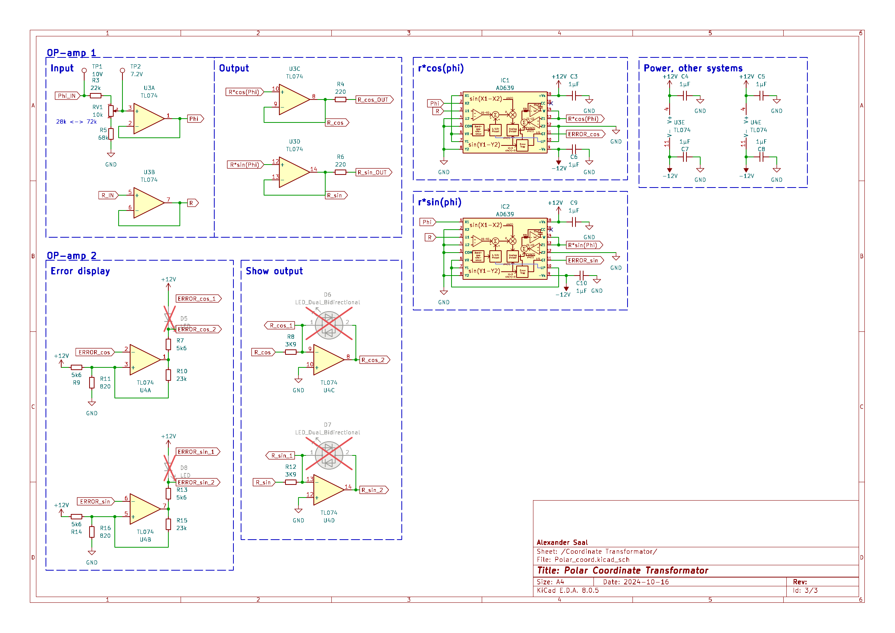
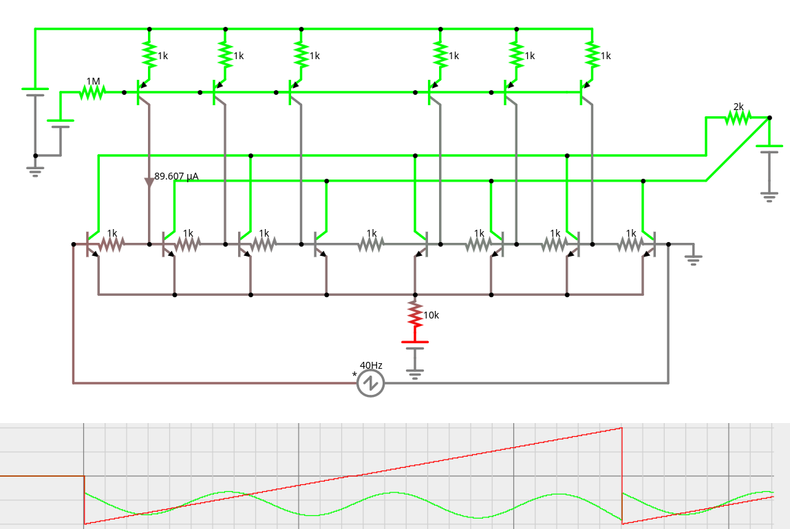

# Analog Computer Polar Coordinate Transformator: $(r,\varphi) \rightarrow (x,y)$
---

Analog computer module for transforming polar coordinates $(r,\varphi)$ into cartesian coordinates $(x,y)$, by using the relationship:

$$
\begin{align}
  x & = r \cdot \cos(\varphi) \\
  y & = r \cdot \sin(\varphi)
\end{align}
$$

Since the direct calculation of the function _sine_ and _cosine_ is complex to implement in an electrical circuit, I rely on the obsolete IC *AD639* of [Analog Devices](https://www.analog.com/en/products/ad639.html#part-details). For the interessed persoin, the inner schematic if the IC is shown in a following [section](#the-inner-workings-of-the-ad639).\
The purpose of this project is to learn more about analog circuits and implementations. The choice to base this circuit on an older, obsolete IC is made out of admiration rather than efficiency. The reader might be able to implement a more modern and cost-efficient circuit in a digital-analog hybrid circuit. I plan to explore this option in a future project.

## Module Schematic

The incoming $\varphi$-signal is scaled down from the machine unit voltage of $10V$ to the scale of $50^\circ/V$, of the AD639, which is $7.2V$. Additionally, the OP-amp is an isolation of the input, to reduce the risk of damaging the AD639.\
The $r$-signal is buffered by an ideal diode circuit to get the absolute value of the signal. This ensures operation, even if the user inputs a negative signal.\
The output signal is also buffered by the same OP-amp to isolate the output of the AD639. This will protect the chip from any accidents, when wiring up the output incorrectly.\
Lastly, the error state of the AD639 is displayed by an LED.

## The inner workings of the AD639

The core is based on a **"KERMIT"**, meaning *“Kommon-EmitteR MultI-Tanh”*, architecture. Probably the first publication of this type of circuit was in _Gilbert, B. IEEE J. Solid-State Circuits, Vol. SC-6, No. 1. pp. 45–55. 1971_.

The circuit of the of the calculation core was taken from a talk by Barie Gilbert himself from the video [_Barrie Gilbert, Analog Devices Inc., NW Labs_](https://youtu.be/sATM6gi7bn8?t=2463) (timestamp of 2463s, last checked 2024.10.17) uploaded by _Electrical Engineering and Computer Science - OSU_ on _Youtube_. Further information can also be found in the article [Considering Multipliers (Part 1) [The Wit and Wisdom of Dr. Leif—7] by Barrie Gilbert ](https://www.analog.com/en/resources/analog-dialogue/articles/considering-multipliers-part-1.html).

The simulation of the KERMIT can be found [here](https://tinyurl.com/256skzmh), made in the _Falstad Circuit Simulator_. Shown in red is the the voltage input from $-2V$ to $2V$, and in green is the output in the approximate range of $-0.67V$ to $-1.6V$. This figure is suprisingly similar to the datashaaet of the _AD693_. I assume, the descrepencies to the ideal shape of the sinus are caused by the unoptimised biasing. I did not take care of that in this simulation.

Additional sources and references:
- A similar implementation can be found on [OpenMusicLabs](http://wiki.openmusiclabs.com/wiki/SineCore), named a SineCore Modulator.
- See also [An Improved Sine Shaper Circuit](https://till.com/articles/sineshaper/).

## Reverse transformation $(x,y) \rightarrow (r,\varphi)$

The reverse is possible: *$(x,y) \rightarrow (r,\varphi)$*\
although more difficult and arguably used even more rarely.\
For completeness sake and as a reminder, I will mention my suggestions for the circuit implementation.\
In general the math is given by:

$$
\begin{align}
  r(x,y) & = \sqrt{x^2 + y^2} \\
  \varphi(x,y) & = r \cdot atan2(x,y) =r \cdot \begin{cases}
  \arctan\left(\frac{y}{x}\right)       & \text{if } x > 0\\
  \arctan\left(\frac{y}{x}\right) + \pi & \text{if } x < 0 \text{ and } y \ge 0\\
  \arctan\left(\frac{y}{x}\right) - \pi & \text{if } x < 0 \text{ and } y < 0\\
  \frac{\pi}{2}                         & \text{if } x = 0 \text{ and } y > 0\\
  -\frac{\pi}{2}                         & \text{if } x = 0 \text{ and } y < 0\\
  \text{undefined}                      & \text{if } x = 0 \text{ and } y = 0.
\end{cases}
\end{align}
$$

which means, that we have to use many comperators in the circuit to differentiate between six different cases in the input $(x,y)$. \
To save on components and to simplify the math, we can look at another option. If the value of $r$ is known at the time of calculation and if the value is $r \neq 0$, then we can use another trigonometric relationship and rewrite $\varphi(x,y)$ into $\varphi(x,r)$:

$$
\begin{equation}
  \varphi(x,y) = \begin{cases}
   \arccos\left(\frac{x}{r}\right) & \text{if } y \ge 0 \text{ and } r \neq 0 \\
  -\arccos\left(\frac{x}{r}\right) & \text{if } y < 0 \text{ and } r \neq 0 \\
   \text{undefined}                & \text{if } r = 0.
\end{cases}
\end{equation}
$$

reducing the cases to differentiate to two.

To be compatible with the previous circuit, we have to take care that the output also scales with $50^\circ/V$.

## License

This work is published under the [CERN Open Hardware Licence Version 2 - Strongly Reciprocal](LICENSE)
